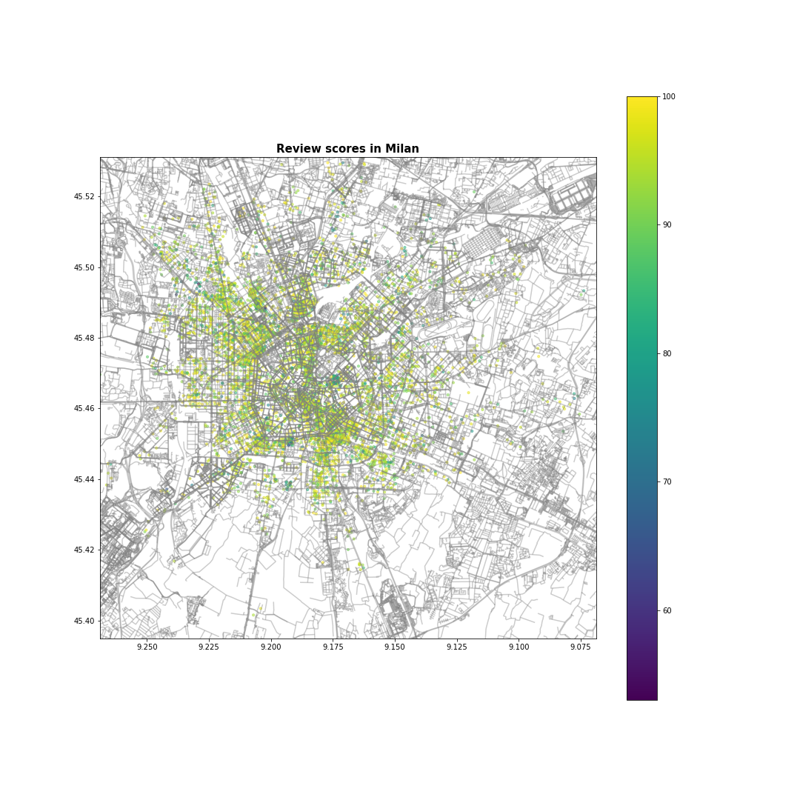

# Analysis of Milan Apartments in Air-BNB.

## Project motivation:
I'm a Consultant in Milan and I was interested in better undersaning if foreigners prefer the center of the city or the suburbs

## Questions:
In this notebook we will find the answer to the following questions:
- Does being closer to the center mean higher daily price?
- Does being closer to the center mean higher review score?
- Can the daily price of a new listing be predicted?

## Files used:
the data used to answer these question was provided by kaggle "https://www.kaggle.com/antoniokaggle/airbnb-milan-price-prediction"
In this dateset we have a lot of columns that refers to the house itself, other that are related to the person which is providing the house, 
and lastly we have a section related to reviews.

The geographical map of milan was used "https://mapcruzin.com/free-italy-arcgis-maps-shapefiles.htm"

## Results:
1. Being closer to the center appears the mean an higher daily prices in Air-bnb apartments

Format: 

2. Being closer to the center doesn't seem to influence the quality of the apartment

Format: 

3. We can use this dataset to predict the price for a new listing

Format: 

## Acknowledgments:
In order to have a good stay in Milan, I'd suggest to take an apartment just outside the city center.
Our underground is pretty good.

## Library used
Data Analysis:
	pandas
	numpy

Graphs:
	matplotlib
	geopandas
	shapely

Machine Learning:
	sklearn